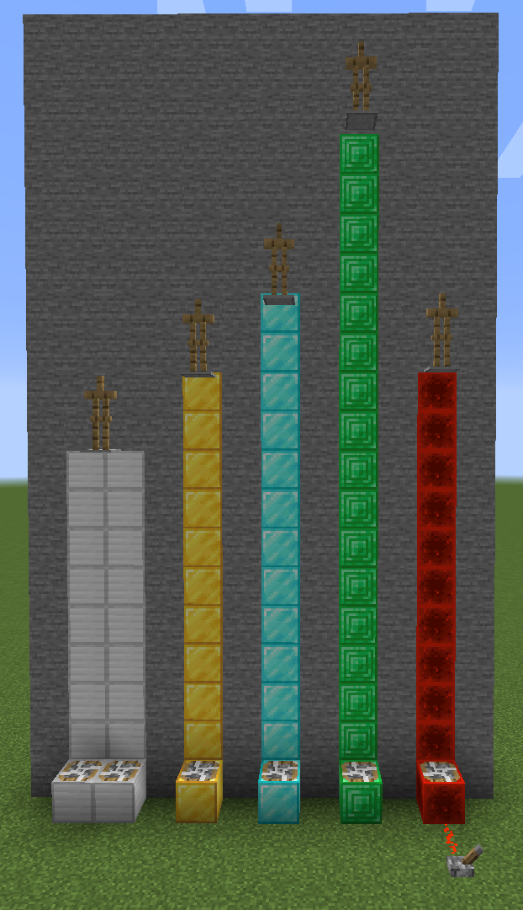
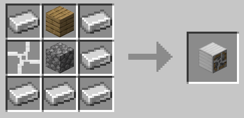
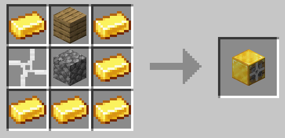
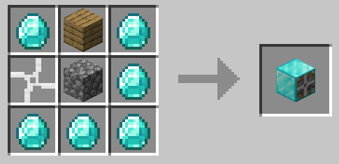
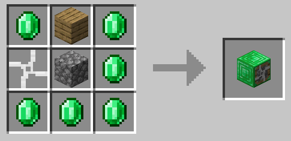
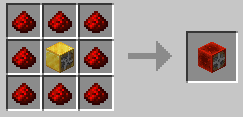
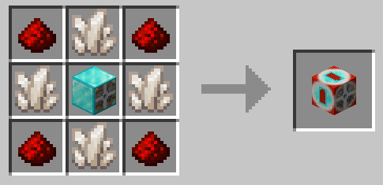

# Fans mod
This is minecraft forge modification adding fans.

### Basic fans
Currently there are iron, gold, diamond and emerald fans (each faster than its predecessor).
Iron fan is weaker than gravity. If entity stands on two fans at once, then their force adds up.

### Redstone fan
Redstone fan has range depending on redstone signal strength.

### Configurable fan
Range of this fan can be configured by right clicking on it (0 blocks - 15 blocks).

### Recipes

